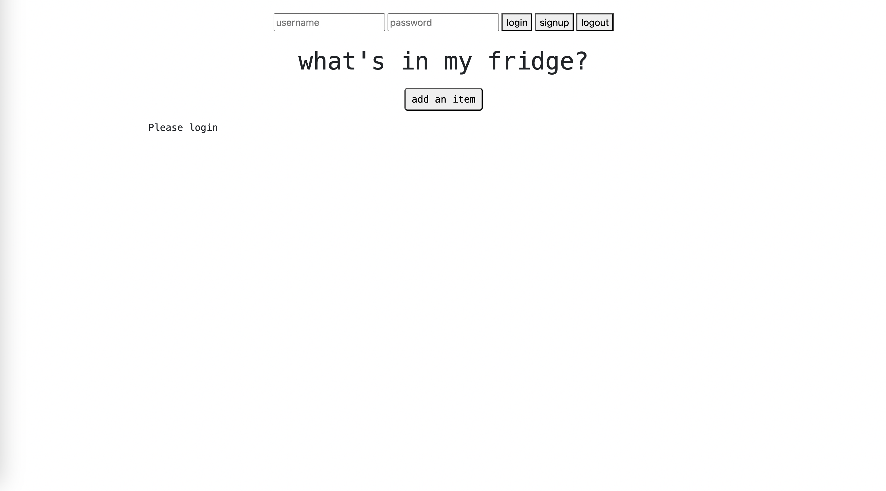
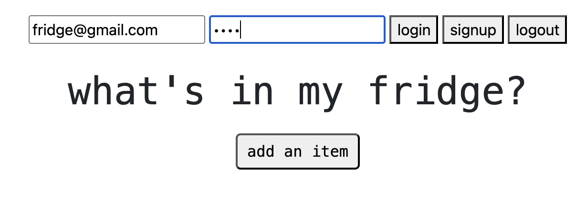
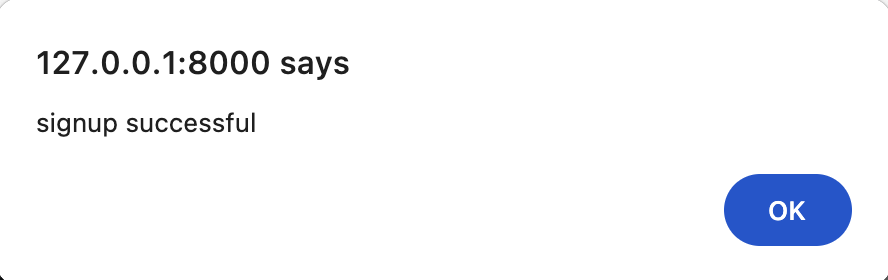
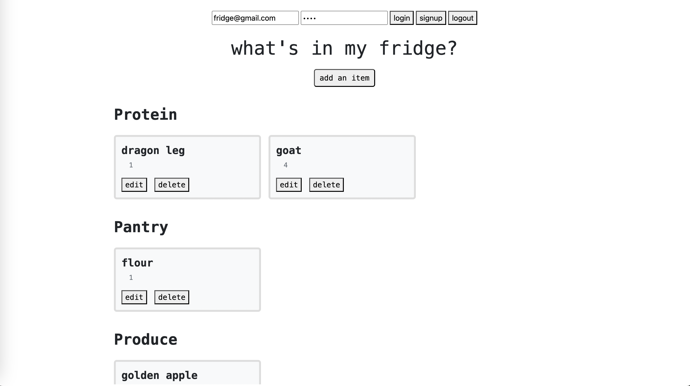
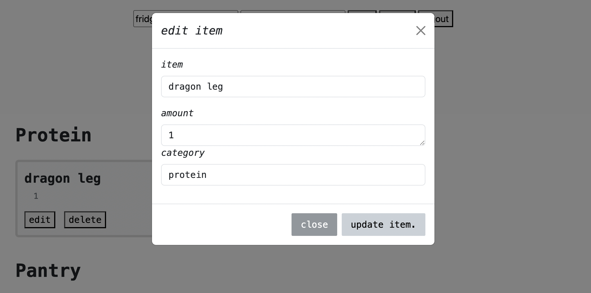
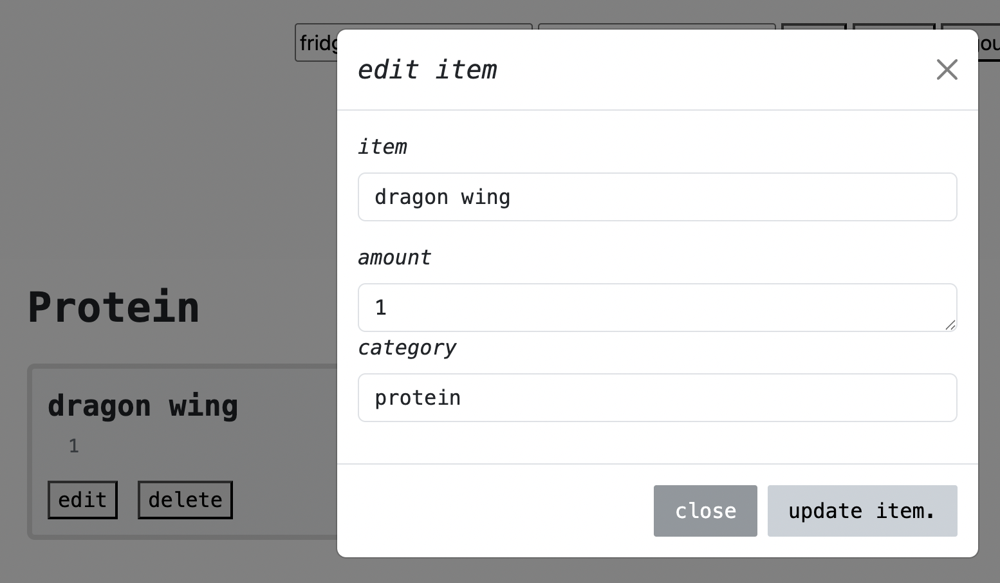
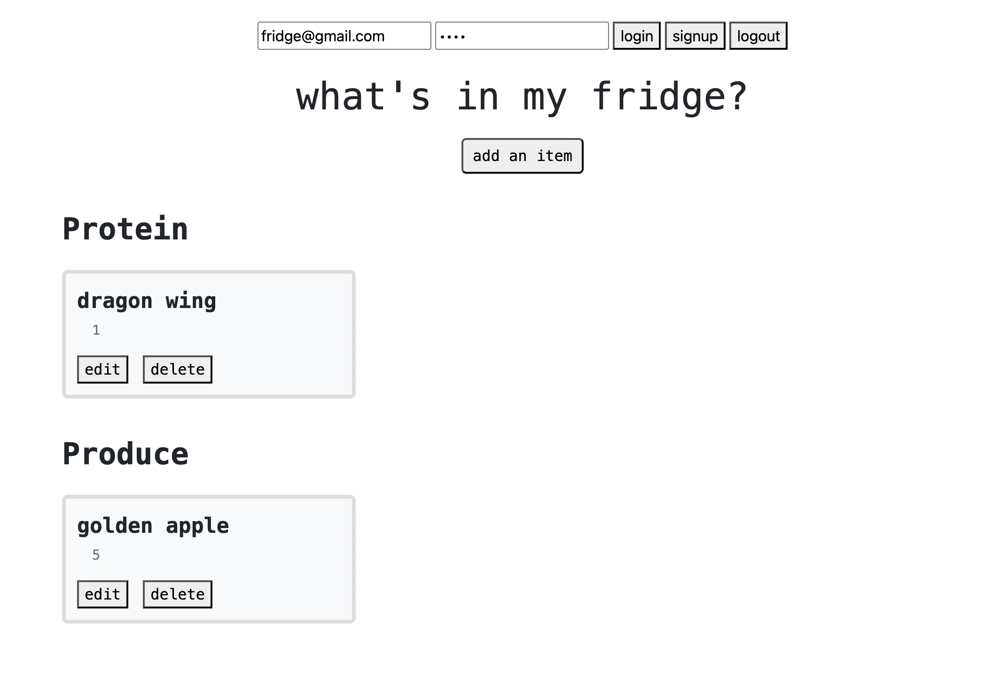
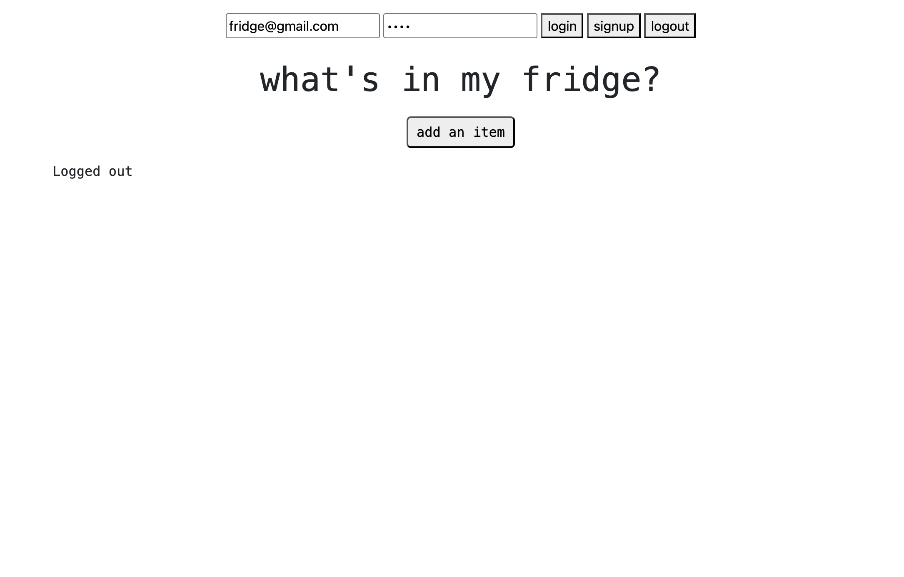

# cs3980HW4, My Fridge w/ MongoDB

## So sorry for the late submission, I had a lot of trouble getting this assingment working

```bash
python3 -m venv venv
source ../.venv/bin/activate  or  . venv/bin/activate
pip3 install fastapi
pip3 install uvicorn
pip3 install pydantic
pip3 install motor
pip3 install bcrypt
uvicorn main:app --reload
```

Add, display, update, and remove the contents of my kitchen so I can visually track which ingredients I have. Now connected to MongoDB.

Built from the CRUD midterm todo app base with FastAPI.

It's not the most intuitive UI, but it is functional with handling authentication, password encryption, routing, CRUD functions, and connecting to MongoDB.

```bash
pip3 freeze > requirements.txt
```
```bash
uvicorn main:app --reload
```
---
## Screenshots
**Main Page**



**Add info for user account**



**Sign up success**



**Adding items**



**Adding items**



**Changes after updating items**



**Changes after deleting items**



**Items cleared after user logs out**

